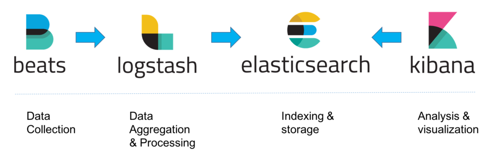

# Introduction
ELK est une solution open source constituée de trois logiciels : Elasticseach, Logstash, Kibana. Cette solution a été développée par Elastic (https://www.elastic.co/) et se nomme aujourd’hui Elastic Stack.

Le tout permet d’entrer des logs pour les parser et les filtrer (Logstash), de les stocker dans un moteur de recherche puissant qui peut gérer de grands volumes de données (Elasticsearch) et d’en faire des tableaux de bord qui comportent des graphiques, tableaux, camemberts et autres. Mais aussi de faire des recherches précises afin de trouver les informations voulues (Kibana). Cet outil est donc très pratique pour visualiser et rechercher des logs et nous évite de lire les fichiers en dur.

# Installation
Installer les éléments suivants comme indiqué sur la documentation officielle (en ajustant la version si nécessaire) :

### ELASTICSEARCH

[Télécharger Elasticsearch](https://www.elastic.co/downloads/elasticsearch)

[Documentation vers Elasticsearch](https://www.elastic.co/guide/en/elastic-stack-get-started/current/get-started-elastic-stack.html#install-elasticsearch)

### FILEBEAT

[Télécharger Filabeat](https://www.elastic.co/downloads/beats/filebeat)

[Documentation vers Filebeat](https://www.elastic.co/guide/en/elastic-stack-get-started/current/get-started-elastic-stack.html#install-beats)

### LOGSTASH

[Télécharger Logstach](https://www.elastic.co/downloads/logstash)

[Documentation versLogstach](https://www.elastic.co/guide/en/elastic-stack-get-started/current/get-started-elastic-stack.html#install-logstash)

### KIBANA

[Télécharger Kibana](https://www.elastic.co/downloads/kibana)

[Documentation vers Kibana](https://www.elastic.co/guide/en/elastic-stack-get-started/current/get-started-elastic-stack.html#install-kibana)
 
# Architecture 
